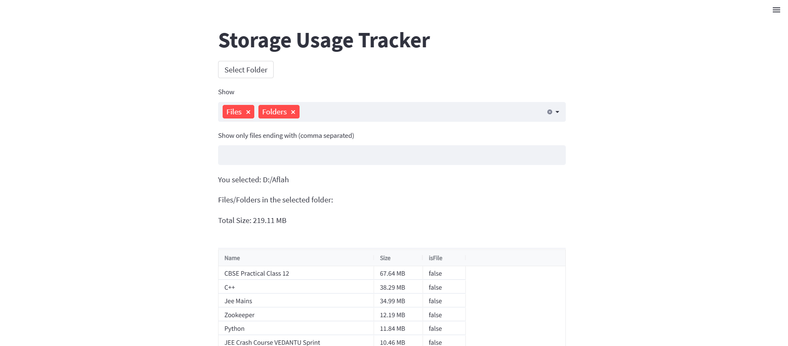

# Storage Usage Tracker

[](https://opensource.org/licenses/MIT)



The File Size Tracker is a simple Streamlit app that provides details for the sizes of all files and folders inside a specified directory. With this app, you can quickly get an overview of the space occupied by different files and subdirectories in a specific folder.

## Getting Started

### Installation

1. Clone this repository to your local machine.
2. Ensure you have Python installed (Python 3.6 or later).
3. Install the required dependencies by running the following command:

```
pip install -r requirements.txt
```

### Usage

1. Navigate to the directory where you have cloned the repository.
2. Run the Streamlit app by executing the following command:

```
streamlit run main.py
```

3. The app will open in your default web browser.

### Instructions

1. Upon opening the app, you will see a button on clicking which you can choose the directory you want to analyze.
2. The app will display a table listing all files and folders within the specified directory, along with their respective sizes in a human-readable format (e.g., KB, MB, GB).
3. The total size of the directory will also be shown at the top of the table.

## Contributing

If you find any issues or have suggestions to improve the File Size Tracker app, please feel free to open an issue or submit a pull request in this repository. Your contributions are highly appreciated!

## License

This project is licensed under the MIT License - see the [LICENSE](https://opensource.org/license/mit/) file for details.

## Acknowledgments

The File Size Tracker app was inspired by the need to quickly assess the sizes of files and folders within a directory without navigating through the file explorer.

---
